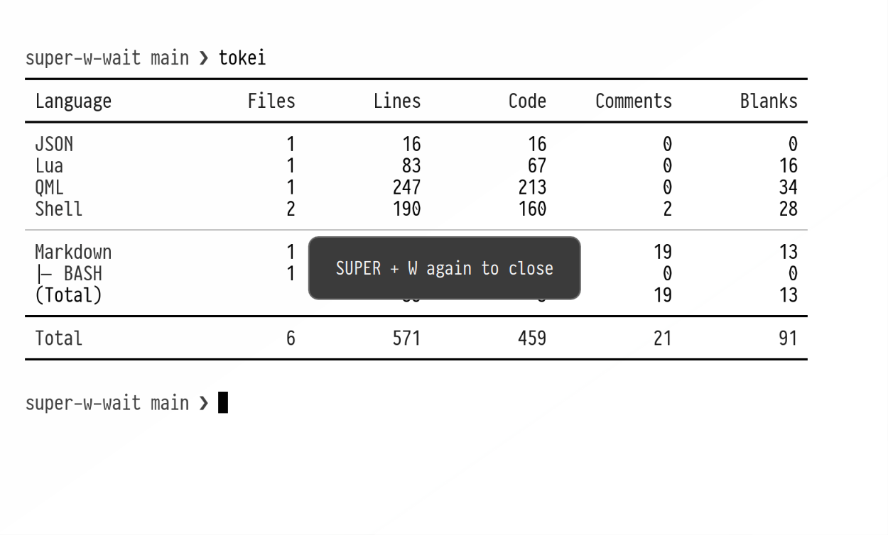

# SUPER + W... wait

You're a Mac user with years of muscle memory. You don't expect `SUPER + W` to close the whole window. This plugin gives you a second chance: the first press just shows a warning. Press it again to close the window.

Requires Omarchy Quattro. No additional packages are required.



## Install

```bash
omarchy plugin add https://github.com/zharinov/super-w-wait.git --enable &&
  ~/.config/omarchy/plugins/io.github.zharinov.super-w-wait/install.sh
```

This command:

1. Downloads and enables the plugin.
2. Installs the Hyprland module and `SUPER + W` binding.
3. Reloads Hyprland and checks the configuration.

## Update

```bash
omarchy plugin update io.github.zharinov.super-w-wait &&
  ~/.config/omarchy/plugins/io.github.zharinov.super-w-wait/install.sh
```

## Uninstall

```bash
~/.config/omarchy/plugins/io.github.zharinov.super-w-wait/uninstall.sh &&
  omarchy plugin remove io.github.zharinov.super-w-wait
```

## License

[MIT](LICENSE)
